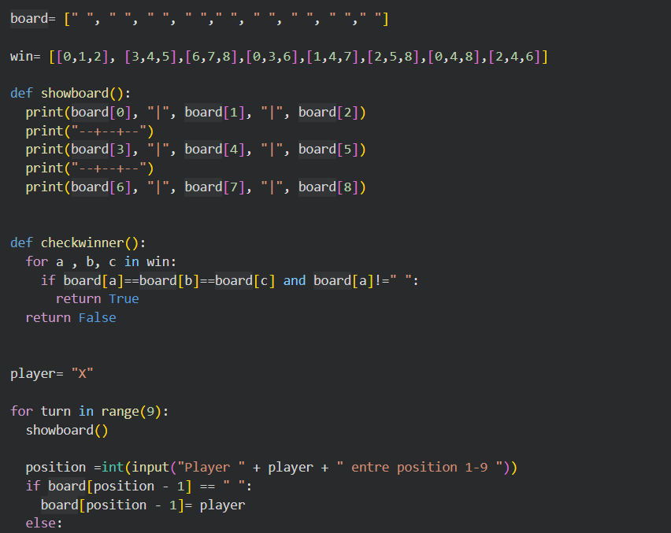
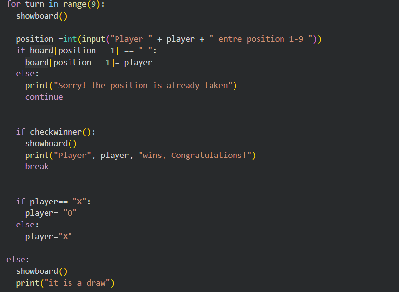
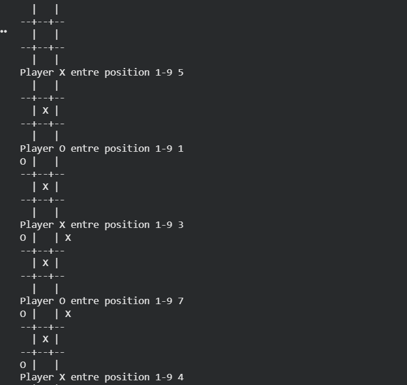
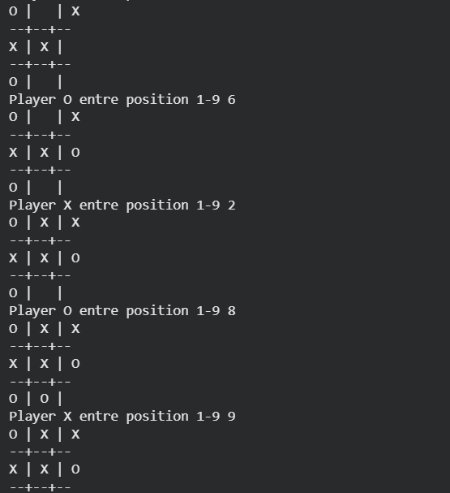

# &#x20;                     Tic-Tac-Toe

Problem statement:

Develop a python program that allow 2 users to play the Tic-Tac-Toe game. The program should display the game board and allow users to entre the positions they want to put their respective positions on. The program should be able to identify the winner and also the draw case by checking for winning combinations.

Target users:

* Students who are learning Python programming.
* Beginners who want to practice basic programming concepts.
* Players who want to play a two-player Tic Tac Toe game.

Over view:

This is a python based Tic-Tac-Toe project designed for 2 players. The 2 players ie X and O take turns placing their respective symbols on the 3\*3 board. The code checks each move to identify the wining combination or a draw. The project uses concepts such as if-else, for loops, defining functions etc.

Features:

* 2 player game using X and O
* 3\*3 game board
* Alternating player turns
* Check for valid moves
* Check for winner and draw
* Show the updated board after every turn

Technologies/tools used:

* Programming language: Python
* Development platform: Google Colab
* Showcasing Platform:  GitHub

Steps to install \& run the project:

* Install Python on your computer from python.org.
* Download or clone the repository with the Tic Tac Toe code from GitHub.
* Open the folder with the project in VS Code, IDLE, or another Python-compatible editor.
* Open the file with the Python code for the game.
* Follow the instructions displayed on the screen and enter your moves when prompted.

Instructions for testing

* Run the Tic Tac Toe program.
* Make sure to type in valid positions.
* Check that the board updates correctly.
* Test all possible winning combinations for both X and O.
* Test a tie game, where all positions are filled, but there is no winner.
* Attempt to make an illegal move, by choosing an already taken position.
* Check if the game displays the winner correctly.
## Screenshots

### Code 1

### Code 2

### Output 1

### Output 2

Scope for project:

The project could be improved in the future by adding more features and making the game more interactive. Some of the possible improvements are listed below:

* Add a computer player so that the user could play against the computer.
* Add a scoring system that would keep track of wins, losses, and draws.
* Make the game have a graphical user interface (GUI)

High-level features:

* 2 player game play
* Display the board
* Allow to play turn by turn
* Detects winning and draw cases

